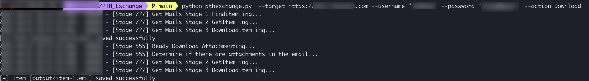
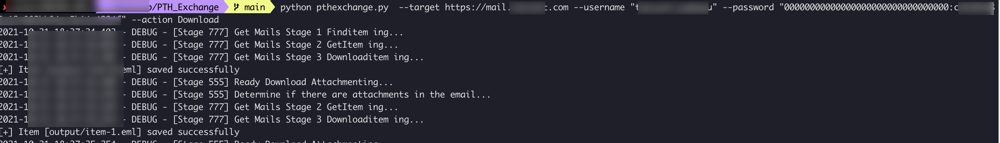

# PTH Exchange

## If you only have hash, you can still operate exchange

## This project module is the same as my other project [Exchange_SSRF](https://github.com/Jumbo-WJB/Exchange_SSRF),  This project uses the correct account password or NTLM HASH, [Exchange_SSRF](https://github.com/Jumbo-WJB/Exchange_SSRF) uses ProxyShell.

### Download user's emails (include attachment) 下载指定用户的邮件，包括附件

run 运行程序（password）：

```
python pthexchange.py  --target https://mail.exchange.com --username "yourusername" --password "yourpassword" --action Download
```
result 结果：




run 运行程序（NTLM HASH）：

```
python pthexchange.py  --target https://mail.exchange.com --username "yourusername" --password "00000000000000000000000000000000:11111111111111111111111111111111" --action Download
```
result 结果：



